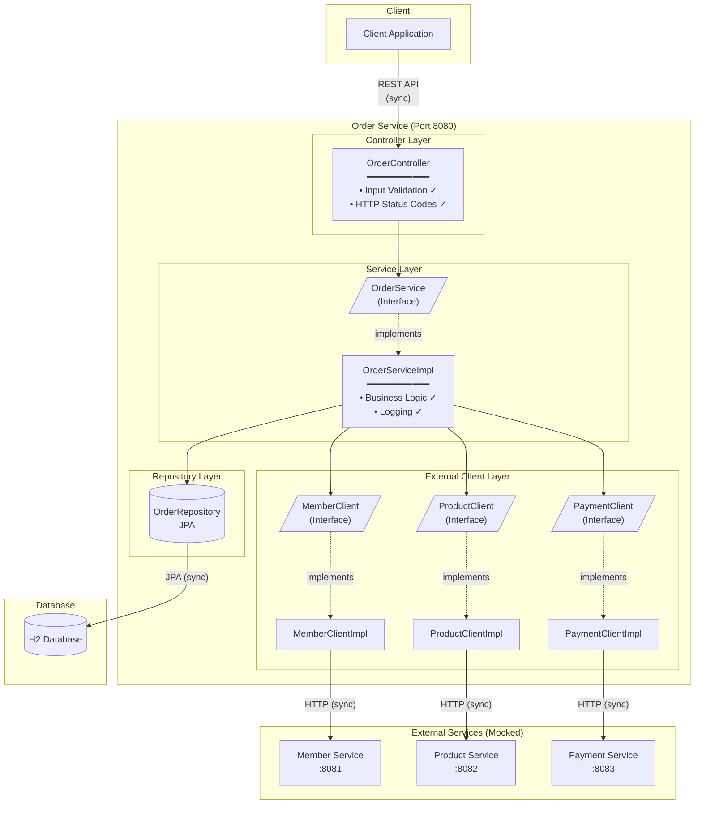
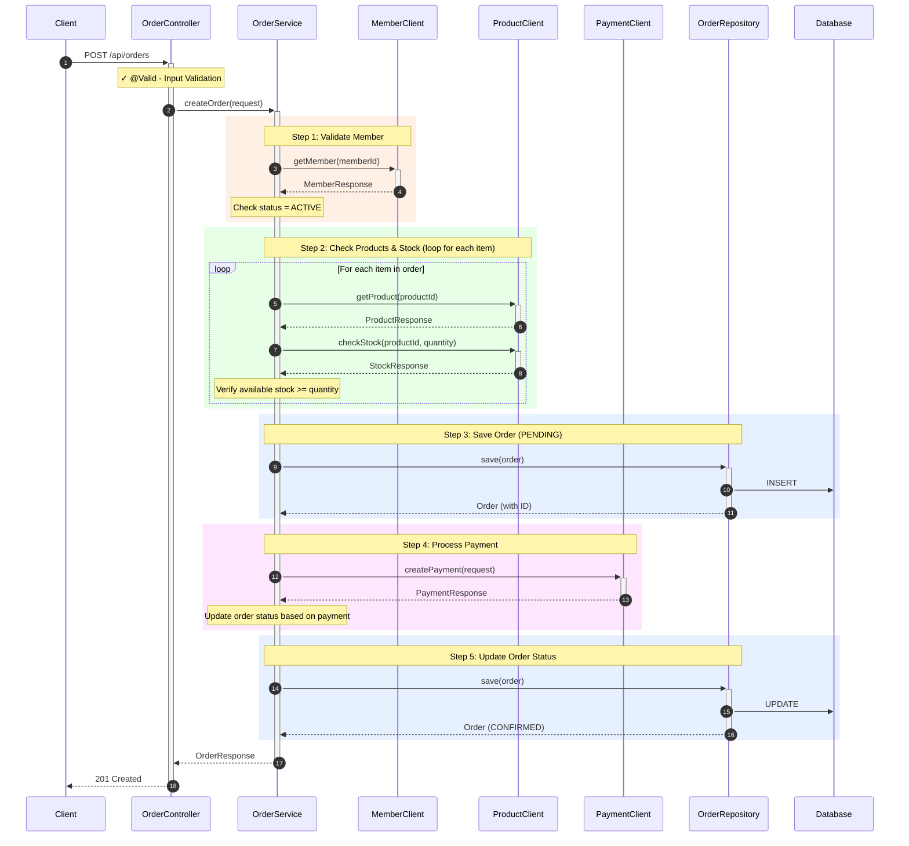
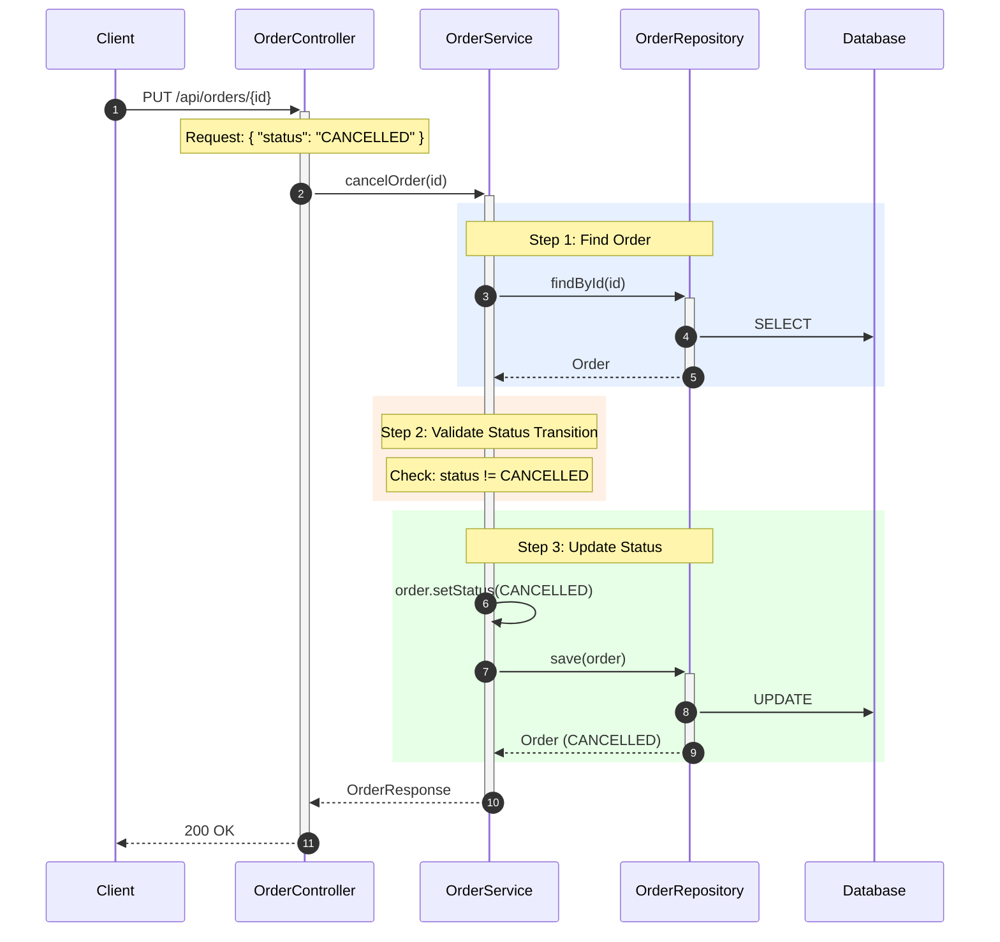
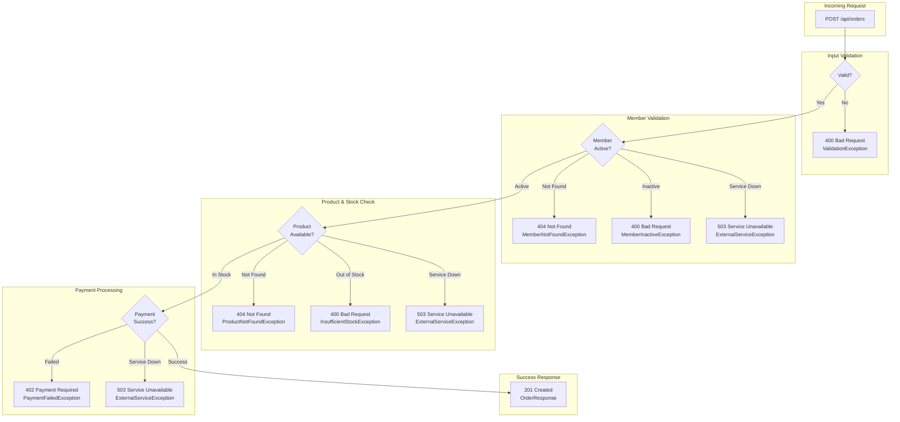

# Order Service - Design Document

## 1. Requirement Analysis

### 1.1 MUST-HAVE (Core Requirements)

Những phần **bắt buộc phải hoàn thành** để bài được đánh giá đạt:

#### Functional - REST APIs
| Priority | Endpoint | Description |
|----------|----------|-------------|
| P0 | `POST /api/orders` | Create order (multi-product) + process payment |
| P0 | `GET /api/orders/{id}` | Get order details with items |
| P1 | `GET /api/orders` | List orders with pagination |
| P2 | `PUT /api/orders/{id}` | Cancel order (status change only) |

#### Order Status Flow
```
┌─────────────────────────────────────────────────────────┐
│                    Order Status Flow                     │
├─────────────────────────────────────────────────────────┤
│                                                         │
│    ┌─────────┐     Payment      ┌───────────┐          │
│    │ PENDING │ ───────OK──────► │ CONFIRMED │          │
│    └────┬────┘                  └─────┬─────┘          │
│         │                             │                 │
│         │ Cancel                      │ Cancel          │
│         ▼                             ▼                 │
│    ┌─────────────────────────────────────┐             │
│    │            CANCELLED                 │             │
│    └─────────────────────────────────────┘             │
│                                                         │
└─────────────────────────────────────────────────────────┘
```

#### External Service Integration
- [ ] Mock Member Service - validate member active
- [ ] Mock Product Service - check product availability + stock
- [ ] Mock Payment Service - process payment
- [ ] **Error handling** khi external service fail/timeout

#### Code Quality (Evaluation Criteria chính)
- [ ] Clean architecture: Controller → Service → Repository
- [ ] SOLID principles (đặc biệt Single Responsibility, Dependency Inversion)
- [ ] Proper HTTP status codes (200, 201, 400, 404, 500)
- [ ] Input validation với meaningful error messages
- [ ] Basic logging (INFO/ERROR level)

#### Testing
- [ ] Unit tests cho Service layer (business logic)
- [ ] Mock external service calls trong tests
- [ ] Coverage cho happy path + error cases

---

### 1.2 SHOULD-HAVE (Nếu còn thời gian)

| Feature | Effort | Impact | Khuyến nghị |
|---------|--------|--------|-------------|
| Integration tests | Medium | High | Viết 1-2 test cơ bản |
| Swagger/OpenAPI docs | Low | Medium | Thêm springdoc-openapi |
| Basic logging | Low | Medium | Slf4j + structured log |

---

### 1.3 SHOULD NOT đào sâu (Time trap)

Những phần dễ tốn thời gian mà interviewer **KHÔNG expect** trong 4 giờ:

| Feature | Lý do không nên đào sâu |
|---------|-------------------------|
| Circuit Breaker (Resilience4j) | Được list là "Bonus" - nice to have |
| Retry với exponential backoff | Phức tạp, dễ bug, tốn thời gian test |
| Docker + docker-compose | Chỉ là deployment concern |
| Database migration (Flyway/Liquibase) | H2 in-memory đủ cho demo |
| Comprehensive monitoring | Quá scope cho 4 giờ |
| Complex validation rules | Validate basic là đủ |
| Caching layer | Over-engineering |
| Async processing | Không yêu cầu |

---

## 2. Architecture Decision

### 2.1 Selected Approach: Layered Architecture + Interface Segregation

```
┌─────────────────────────────────────────────────────────┐
│                    Controller Layer                      │
│              (REST endpoints, validation)                │
├─────────────────────────────────────────────────────────┤
│                     Service Layer                        │
│    ┌─────────────┐              ┌──────────────────┐    │
│    │  Interface  │◄─────────────│  Implementation  │    │
│    └─────────────┘              └──────────────────┘    │
├─────────────────────────────────────────────────────────┤
│                   Repository Layer                       │
│                  (JPA Repositories)                      │
├─────────────────────────────────────────────────────────┤
│                 External Client Layer                    │
│    ┌─────────────┐              ┌──────────────────┐    │
│    │  Interface  │◄─────────────│  Implementation  │    │
│    │ (Contract)  │              │  (HTTP / Mock)   │    │
│    └─────────────┘              └──────────────────┘    │
└─────────────────────────────────────────────────────────┘
```

### 2.2 Why This Approach?

| Reason | Explanation |
|--------|-------------|
| **Balance** | Cân bằng giữa clean code và delivery speed |
| **Testability** | Interface abstraction cho phép mock external services dễ dàng |
| **SOLID Compliance** | Đảm bảo Dependency Inversion Principle (DIP) |
| **Pragmatic** | Không over-engineering, phù hợp time constraint 4 giờ |
| **Familiar** | Dựa trên Spring Boot conventions, dễ đọc và maintain |

### 2.3 Why NOT Other Approaches?

#### ❌ Traditional Layered (Approach 1)

```java
// Problem: Service directly depends on implementation
@Service
public class OrderService {
    @Autowired
    private RestTemplate restTemplate;  // Tight coupling!

    public void validateMember(String memberId) {
        restTemplate.getForObject(...);  // Hard to test
    }
}
```

| Reason to Reject | Impact |
|------------------|--------|
| Tight coupling với HTTP client | Khó mock trong unit test |
| Không thể hiện được SOLID principles | Thiếu điểm evaluation |
| Khó swap implementation | Inflexible khi cần thay đổi |

#### ❌ Hexagonal Architecture (Approach 3)

```
adapter/in/rest/
adapter/out/persistence/
adapter/out/http/
application/port/in/
application/port/out/
application/service/
domain/
```

| Reason to Reject | Impact |
|------------------|--------|
| Setup time ~45+ phút | Chiếm >15% total time |
| 8-10 packages, nhiều boilerplate | Risk không hoàn thành |
| Over-engineering cho scope này | Interviewer có thể đánh giá "không pragmatic" |
| Chỉ phù hợp khi deadline thoải mái | Không match với 4-hour constraint |

### 2.4 Trade-off Summary

```
                        Complexity
                             │
        Hexagonal      ──────┼────────── Over-engineering risk
                             │
                             │
     ✅ Layered + IF   ──────┼────────── SWEET SPOT
                             │
                             │
        Traditional    ──────┼────────── Under-engineering risk
                             │
                        ─────┴─────────────────────────────▶ Time
                            1h     2h     3h     4h
```

### 2.5 Project Structure

```
src/main/java/com/sotatek/order/
├── controller/
│   └── OrderController.java
├── service/
│   ├── OrderService.java                 ← Interface (contract)
│   └── impl/
│       └── OrderServiceImpl.java         ← Business logic
├── repository/
│   ├── OrderRepository.java              ← Spring Data JPA
│   └── OrderItemRepository.java          ← For order items
├── client/
│   ├── MemberClient.java                 ← Interface
│   ├── ProductClient.java                ← Interface
│   ├── PaymentClient.java                ← Interface
│   └── impl/
│       ├── MemberClientImpl.java         ← HTTP calls / Mock
│       ├── ProductClientImpl.java
│       └── PaymentClientImpl.java
├── model/
│   ├── entity/
│   │   ├── Order.java                    ← Parent entity
│   │   └── OrderItem.java                ← Child entity (products in order)
│   ├── dto/
│   │   ├── request/
│   │   │   ├── CreateOrderRequest.java
│   │   │   ├── OrderItemRequest.java     ← Item in request
│   │   │   └── CancelOrderRequest.java
│   │   └── response/
│   │       ├── OrderResponse.java
│   │       └── OrderItemResponse.java    ← Item in response
│   └── enums/
│       └── OrderStatus.java
├── exception/
│   ├── GlobalExceptionHandler.java
│   ├── OrderNotFoundException.java
│   └── InvalidStatusTransitionException.java
└── config/
    └── RestClientConfig.java
```

### 2.6 Data Model (Entity Relationship)

```
┌─────────────────────────────────────────────────────────┐
│                    Order (Parent)                        │
├─────────────────────────────────────────────────────────┤
│  id: Long (PK)                                          │
│  memberId: String                                        │
│  status: OrderStatus (PENDING/CONFIRMED/CANCELLED)      │
│  totalAmount: BigDecimal                                │
│  paymentMethod: String                                  │
│  createdAt: LocalDateTime                               │
│  updatedAt: LocalDateTime                               │
├─────────────────────────────────────────────────────────┤
│                    │ 1:N                                │
│                    ▼                                    │
├─────────────────────────────────────────────────────────┤
│                  OrderItem (Child)                      │
├─────────────────────────────────────────────────────────┤
│  id: Long (PK)                                          │
│  orderId: Long (FK)                                     │
│  productId: String                                      │
│  productName: String (snapshot)                         │
│  quantity: Integer                                      │
│  unitPrice: BigDecimal (snapshot)                       │
│  subtotal: BigDecimal                                   │
└─────────────────────────────────────────────────────────┘
```

---

## 3. High-Level Architecture Diagram

### 3.1 System Context (Mermaid)



### 3.2 Create Order Flow (Sequence Diagram)



### 3.3 Cancel Order Flow (Sequence Diagram)



### 3.4 Error Handling Flow



### 3.5 Requirements Coverage Map

| Layer | Component | Requirements Covered |
|-------|-----------|---------------------|
| **Controller** | `@Valid` annotations | ✅ Input validation |
| **Controller** | `@RestController` | ✅ RESTful API design |
| **Controller** | `ResponseEntity<>` | ✅ Proper HTTP status codes |
| **Service** | Interface + Impl | ✅ SOLID (DIP) |
| **Service** | Business logic separation | ✅ Layer separation |
| **Service** | `@Slf4j` logging | ✅ Logging for debugging |
| **Client** | Interface abstraction | ✅ Easy to mock in tests |
| **Client** | Try-catch in Impl | ✅ Error handling |
| **Exception** | `@ControllerAdvice` | ✅ Meaningful error messages |
| **Repository** | Spring Data JPA | ✅ Data persistence |
| **Test** | Mock client interfaces | ✅ Unit test with mocking |

---

## 4. API Contract Summary

### 4.1 Endpoints Overview

| Method | Endpoint | Request Body | Response | Status Codes |
|--------|----------|--------------|----------|--------------|
| POST | `/api/orders` | CreateOrderRequest | OrderResponse | 201, 400, 404, 503 |
| GET | `/api/orders/{id}` | - | OrderResponse | 200, 404 |
| GET | `/api/orders` | - | Page\<OrderResponse\> | 200 |
| PUT | `/api/orders/{id}` | CancelOrderRequest | OrderResponse | 200, 400, 404 |

### 4.2 Request/Response DTOs

#### CreateOrderRequest (Multi-product)
```json
{
  "memberId": "string (required)",
  "items": [
    {
      "productId": "string (required)",
      "quantity": "integer (required, > 0)"
    }
  ],
  "paymentMethod": "enum: CREDIT_CARD | DEBIT_CARD | BANK_TRANSFER"
}
```

#### CancelOrderRequest
```json
{
  "status": "CANCELLED"
}
```

#### OrderResponse (with items)
```json
{
  "id": "long",
  "memberId": "string",
  "items": [
    {
      "productId": "string",
      "productName": "string",
      "quantity": "integer",
      "unitPrice": "decimal",
      "subtotal": "decimal"
    }
  ],
  "totalAmount": "decimal",
  "status": "enum: PENDING | CONFIRMED | CANCELLED",
  "paymentMethod": "string",
  "createdAt": "datetime",
  "updatedAt": "datetime"
}
```

#### ErrorResponse
```json
{
  "error": "ERROR_CODE",
  "message": "Human readable message",
  "timestamp": "datetime"
}
```

### 4.3 HTTP Status Codes

| Code | Meaning | When |
|------|---------|------|
| 200 | OK | GET, PUT success |
| 201 | Created | POST success |
| 400 | Bad Request | Validation error, invalid status transition |
| 404 | Not Found | Order/Member/Product not found |
| 503 | Service Unavailable | External service down |

---

## 5. Time Allocation Strategy (4 hours)

| Phase | Duration | Tasks |
|-------|----------|-------|
| **Setup** | 30 min | Project structure, entities, database config |
| **Core APIs** | 90 min | CRUD endpoints + service layer |
| **External Integration** | 45 min | Mock services + error handling |
| **Testing** | 45 min | Unit tests cho business logic |
| **Polish** | 30 min | Documentation, cleanup, final test |

---

## 6. Definition of Done

Bài được coi là **hoàn thành tốt** khi:

- [ ] 5 REST endpoints hoạt động đúng
- [ ] External services được mock và handle errors
- [ ] Code clean, có layer separation rõ ràng
- [ ] Unit tests pass cho core business logic
- [ ] README giải thích được design decisions
- [ ] `./gradlew build` pass không lỗi

---

## 7. Key Insight

> *"Don't overthink it - A working solution with clean code is better than
> an over-engineered incomplete one"*

**Điều interviewer thực sự muốn thấy:**
1. Deliver working software trong time constraint
2. Code structure phản ánh tư duy architect
3. Xử lý edge cases một cách pragmatic
4. Biết trade-off giữa "perfect" và "done"

---

## 8. Design Critique (Senior Review)

> *"Every architecture has trade-offs. The mark of a good architect is knowing what they are."*

### 8.1 Critical Weaknesses

#### 🔴 W1: Synchronous Chain - Latency Bomb

```
POST /api/orders latency breakdown:
┌─────────────────────────────────────────────────────────────┐
│  Member Service     Product Service (×N)      Payment       │
│      100ms    +    150ms × 5 items = 750ms  +   500ms       │
│                                                              │
│  Total worst case: 100 + 750 + 500 = 1350ms per request    │
│  With timeout/retry: Could exceed 5-10 seconds             │
└─────────────────────────────────────────────────────────────┘
```

| Problem | Impact | Mitigation (not in scope) |
|---------|--------|---------------------------|
| Sequential calls | Latency scales with items | Parallel validation |
| No timeout config | Request hangs indefinitely | RestTemplate timeout |
| No async option | Thread pool exhaustion | WebClient reactive |

#### 🔴 W2: No Idempotency - Duplicate Orders

```
Scenario: Network hiccup during POST /api/orders

Client ──► Order Service ──► Payment ──► DB
  │              │              │         │
  │              │              ✓ Charged │
  │              │                        │
  │    ✗ Timeout (network)               │
  │                                        │
  └─────── Retry POST /api/orders ────────┘
                 │
                 ▼
         💀 Double charge!
```

| Missing | Risk Level | Industry Standard |
|---------|------------|-------------------|
| Idempotency key | **HIGH** | X-Idempotency-Key header |
| Request deduplication | **HIGH** | Redis-based dedup |
| Payment reference tracking | **MEDIUM** | Unique payment ID |

#### 🔴 W3: Race Condition - Overselling

```
Timeline: 2 concurrent orders, Product stock = 1

T1: Order A ──► checkStock(P1) ──► returns 1 ✓
T2: Order B ──► checkStock(P1) ──► returns 1 ✓
T3: Order A ──► processPayment() ──► success
T4: Order B ──► processPayment() ──► success
T5: Both orders confirmed ──► Stock = -1 💀
```

| Assumption | Reality | Consequence |
|------------|---------|-------------|
| "Low traffic" | Black Friday, flash sale | Overselling |
| "Point-in-time check" | No reservation | Inventory negative |
| "No locking" | Concurrent requests | Data inconsistency |

#### 🟠 W4: No Compensation / Saga Pattern

```
Failure scenario: Payment succeeds, DB fails

Step 1: Validate Member    ✓
Step 2: Check Products     ✓
Step 3: Save Order         ✓ (PENDING)
Step 4: Process Payment    ✓ (Money charged!)
Step 5: Update Status      ✗ (DB connection lost)

Result:
- Customer charged
- Order stuck in PENDING
- No automatic refund
- Manual intervention required
```

#### 🟠 W5: Cancel After Payment - No Refund

```
Current flow:
CONFIRMED ──► CANCELLED (status change only)

Missing:
- No Payment Service refund call
- No stock restoration
- Customer charged but order cancelled
```

### 8.2 Failure Scenarios at Scale

#### Scenario 1: External Service Degradation

```
┌────────────────────────────────────────────────────────────┐
│                  CASCADE FAILURE                            │
├────────────────────────────────────────────────────────────┤
│                                                             │
│  Product Service slow (5s response)                        │
│           │                                                 │
│           ▼                                                 │
│  Order Service threads blocked (waiting)                   │
│           │                                                 │
│           ▼                                                 │
│  Thread pool exhausted (200 threads stuck)                 │
│           │                                                 │
│           ▼                                                 │
│  ALL endpoints unresponsive (not just POST)               │
│           │                                                 │
│           ▼                                                 │
│  Health check fails → Container restart → Data loss        │
│                                                             │
└────────────────────────────────────────────────────────────┘

Missing: Circuit Breaker, Bulkhead, Timeout
```

#### Scenario 2: Database Connection Exhaustion

```
H2 in-memory limitations:
- Single instance only
- No connection pooling config shown
- No read replica
- Memory-bound (OOM risk)

At 1000 concurrent users:
- Connection pool exhausted
- Request queue grows
- Memory pressure
- GC pauses
- Eventually: OutOfMemoryError
```

#### Scenario 3: Multi-Product Validation Explosion

```
Order with 50 items:
- 50 × getProduct() calls
- 50 × checkStock() calls
- 100 external API calls total
- Sequential: 100 × 100ms = 10 seconds minimum

Result: Request timeout, poor UX, resource waste
```

### 8.3 Risky Assumptions Analysis

| # | Assumption | Risk | Why Risky |
|---|------------|------|-----------|
| 1 | "Low traffic" | 🔴 **CRITICAL** | Cannot predict traffic spikes. Black Friday, marketing campaign, viral moment. Race conditions become real. |
| 2 | "Sync payment" | 🔴 **CRITICAL** | Real payment gateways (Stripe, PayPal) prefer async webhooks. Sync calls timeout at gateway level. |
| 3 | "No refund flow" | 🟠 **HIGH** | CONFIRMED → CANCELLED without refund = customer complaint + chargeback risk. |
| 4 | "Mock services behave well" | 🟠 **HIGH** | Real services: network partition, partial failures, inconsistent data, rate limiting. |
| 5 | "Price snapshot is enough" | 🟡 **MEDIUM** | Price change between validation and payment = revenue loss or customer dispute. |
| 6 | "H2 is fine" | 🟡 **MEDIUM** | Data loss on restart, no persistence, no scaling, no backup. |
| 7 | "No auth needed" | 🟡 **MEDIUM** | Any client can create orders for any memberId. Fraud risk. |

### 8.4 Technical Debt Summary

```
┌─────────────────────────────────────────────────────────────┐
│                    TECHNICAL DEBT QUADRANT                   │
├──────────────────────────┬──────────────────────────────────┤
│   RECKLESS & DELIBERATE  │    PRUDENT & DELIBERATE          │
│   ─────────────────────  │    ─────────────────────         │
│   • No idempotency       │    • No circuit breaker          │
│   • No refund on cancel  │    • H2 instead of real DB       │
│   • Race condition risk  │    • Sync instead of async       │
│                          │    • No distributed tracing      │
├──────────────────────────┼──────────────────────────────────┤
│   RECKLESS & INADVERTENT │    PRUDENT & INADVERTENT         │
│   ─────────────────────  │    ─────────────────────         │
│   • Payment without      │    • Multi-product loop          │
│     compensation         │      latency                     │
│   • No timeout config    │    • Offset pagination           │
│                          │      (expensive at scale)        │
└──────────────────────────┴──────────────────────────────────┘

Legend:
- Prudent & Deliberate: Known trade-offs, accepted for time constraint
- Reckless & Deliberate: Shortcuts that will cause problems
- Inadvertent: Didn't realize it was debt until now
```

### 8.5 Interview Defense Strategy

Khi bị challenge về các điểm yếu, cách trả lời:

| Challenge | Acknowledge | Explain Trade-off | Production Fix |
|-----------|-------------|-------------------|----------------|
| "Idempotency?" | "Yes, critical gap" | "4-hour scope" | "Add X-Idempotency-Key + Redis dedup" |
| "Race condition?" | "Yes, oversell risk" | "Assumed low traffic" | "Redis distributed lock hoặc DB pessimistic lock" |
| "No circuit breaker?" | "Yes, cascade failure risk" | "Bonus feature" | "Resilience4j với fallback" |
| "Sync payment?" | "Yes, latency issue" | "Simpler to implement" | "Async + webhook + status polling" |
| "Cancel no refund?" | "Yes, incomplete flow" | "Out of scope" | "Add PaymentClient.refund() call" |

> **Key insight**: Biết điểm yếu của thiết kế mình quan trọng hơn là có thiết kế hoàn hảo.

---

## 9. Pragmatic Review (4-Hour Reality Check)

> *"Perfect is the enemy of done. In a 4-hour assignment, 'done' wins."*

### 9.1 Over-Engineering Risks

| Component | Current Design | Risk | Pragmatic Alternative |
|-----------|---------------|------|----------------------|
| **CancelOrderRequest DTO** | Full DTO class với `{ "status": "CANCELLED" }` | 🟡 Overkill | Có thể dùng `POST /api/orders/{id}/cancel` không cần body |
| **OrderItemResponse DTO** | Separate DTO class | 🟡 Extra files | Có thể embed trong OrderResponse |
| **Interface cho mọi Service** | OrderService interface + Impl | 🟢 OK nhưng có thể skip | Direct implementation với `@Service` cũng được |
| **3 External Client interfaces** | MemberClient, ProductClient, PaymentClient | 🟡 Nhiều files | Có thể gộp thành 1 ExternalServiceClient |
| **Detailed Error Codes** | Multiple custom exceptions | 🟡 Time consuming | Generic `BusinessException` với message là đủ |

### 9.2 Simplifications Hợp Lý (Keep These)

| Simplification | Why It's Smart |
|----------------|----------------|
| ✅ **H2 in-memory** | Zero config, auto-create schema, đủ cho demo |
| ✅ **Mock services trong code** | Không cần setup WireMock server |
| ✅ **No authentication** | Scope nói rõ "giả định đã auth ở gateway" |
| ✅ **Sync flow** | Async phức tạp, timeout handling khó |
| ✅ **Offset pagination** | Simple, đủ cho demo data |
| ✅ **No refund logic** | Out of scope, acknowledge là được |
| ✅ **3 statuses only** | PENDING → CONFIRMED → CANCELLED đủ rồi |

### 9.3 Nên Explicit Mark Out-of-Scope

Thêm comment/doc rõ ràng những thứ KHÔNG làm:

```java
/**
 * OUT OF SCOPE (4-hour constraint):
 * - Circuit breaker (Resilience4j)
 * - Retry mechanism
 * - Distributed tracing
 * - Async payment webhooks
 * - Inventory locking
 * - Idempotency keys
 * - Rate limiting
 * - Caching
 *
 * These would be required for production deployment.
 */
```

### 9.4 Time Budget Reality

```
┌─────────────────────────────────────────────────────────────┐
│                 4-HOUR TIME BUDGET                          │
├─────────────────────────────────────────────────────────────┤
│                                                             │
│  MUST FINISH (3 hours)                                      │
│  ├── Project setup + entities        [30 min] ████         │
│  ├── POST /orders (core flow)        [60 min] ████████     │
│  ├── GET /orders/{id}                [15 min] ██           │
│  ├── GET /orders (pagination)        [20 min] ███          │
│  ├── PUT /orders/{id} (cancel)       [15 min] ██           │
│  └── Basic unit tests                [40 min] █████        │
│                                                             │
│  NICE TO HAVE (1 hour buffer)                              │
│  ├── Error handling polish           [20 min]              │
│  ├── More test coverage              [20 min]              │
│  └── Documentation                   [20 min]              │
│                                                             │
│  DO NOT START                                               │
│  ├── Circuit breaker                 ❌                     │
│  ├── Docker setup                    ❌                     │
│  ├── Swagger UI customization        ❌                     │
│  └── Performance optimization        ❌                     │
│                                                             │
└─────────────────────────────────────────────────────────────┘
```

### 9.5 Recommended Cuts (If Running Out of Time)

Nếu hết giờ, cắt theo thứ tự:

| Priority | Cut | Impact | Justification |
|----------|-----|--------|---------------|
| 1st | Swagger annotations | Low | API works without docs |
| 2nd | PUT /orders (cancel) | Medium | 3 endpoints vẫn đủ điểm |
| 3rd | Pagination | Medium | Return all orders, note "pagination pending" |
| 4th | Some unit tests | Medium | Có 1-2 happy path tests là đủ |
| ❌ Never | POST /orders | Fatal | Core requirement, must have |
| ❌ Never | GET /orders/{id} | Fatal | Cannot verify order created |

### 9.6 Final Checklist (Before Submit)

```
PRE-SUBMISSION CHECKLIST:

[ ] ./gradlew build passes
[ ] ./gradlew test passes
[ ] Application starts without error
[ ] POST /orders works with valid request
[ ] GET /orders/{id} returns created order
[ ] Error response format is consistent
[ ] Code compiles without warnings
[ ] No hardcoded secrets/credentials
[ ] README has run instructions

BONUS (if time permits):
[ ] All 4 endpoints work
[ ] Unit tests for service layer
[ ] Swagger UI accessible
[ ] Code comments explain design decisions
```

### 9.7 What Interviewers Actually Evaluate

```
┌─────────────────────────────────────────────────────────────┐
│              INTERVIEWER PRIORITY MATRIX                     │
├─────────────────────────────────────────────────────────────┤
│                                                             │
│  HIGH WEIGHT (60%)                                          │
│  ├── ✓ Code compiles and runs                              │
│  ├── ✓ Core API works (POST + GET)                         │
│  ├── ✓ Clean code structure                                │
│  └── ✓ Error handling exists                               │
│                                                             │
│  MEDIUM WEIGHT (30%)                                        │
│  ├── ○ All endpoints implemented                           │
│  ├── ○ Unit tests present                                  │
│  ├── ○ External service integration                        │
│  └── ○ SOLID principles visible                            │
│                                                             │
│  LOW WEIGHT (10%)                                           │
│  ├── △ Swagger documentation                               │
│  ├── △ Comprehensive tests                                 │
│  ├── △ Fancy error messages                                │
│  └── △ Circuit breaker (bonus)                             │
│                                                             │
│  Legend: ✓ Must have | ○ Should have | △ Nice to have      │
│                                                             │
└─────────────────────────────────────────────────────────────┘
```

> **Bottom line**: Một ứng dụng chạy được với 3 endpoints + clean code > Một ứng dụng perfect design nhưng không compile.
